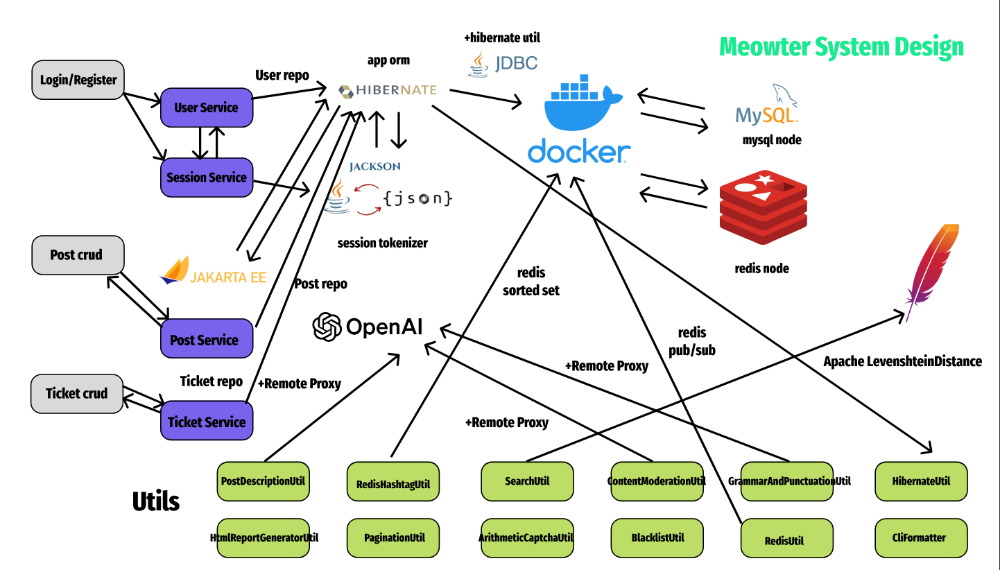

# Project 1



[Meowter](Project1_Final.pdf)

<ul>
<li>
clone in your computer: 

```
git clone your_repo_url
cd your_repo_dir
```
</li>

<li>
run tests from terminal:

```
./gradlew clean test
```
</li>

<li>
push changes to the repository:

```
git add . 
git commit -m "commit message"
git push
```
</li>
</ul>
